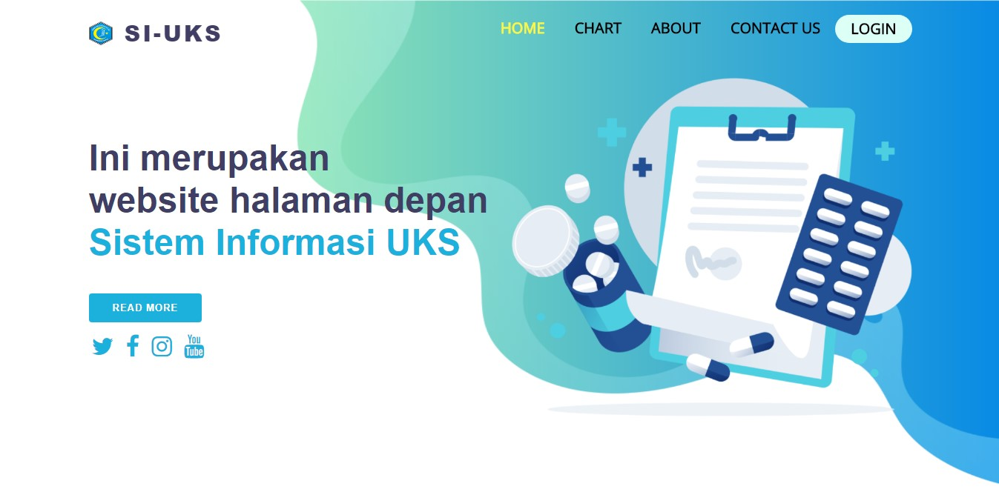
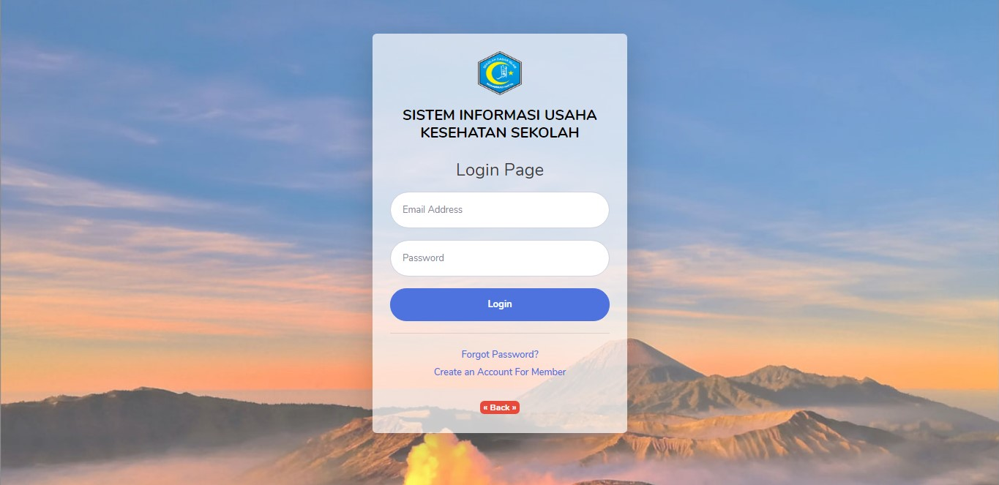
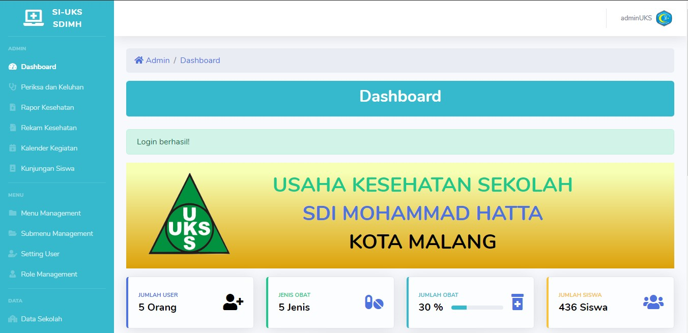
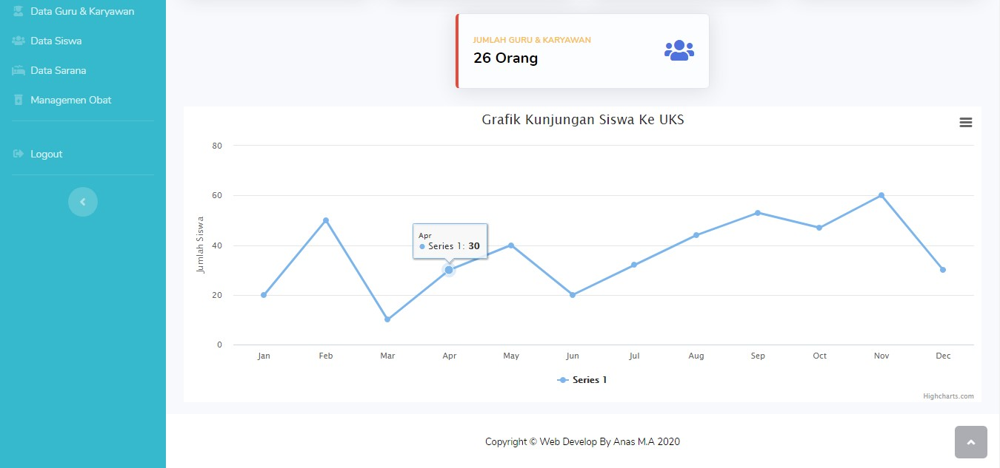

<body>
<h1> SI-UKS-v0.2 </h1>

Sistem Informasi UKS ini merupakan hasil aplikasi yang saya buat sebagai Tugas Akhir meskipun belum sempurna ,<strong>Dibuat dengan :</strong>

    <strong>Front-end Web</strong>
    <ol>
        <ul>
            <li>Rapid Theme</li>
            <li>Bootstrap</li>
            <li>Highchart JS</li>
        </ul>
        <strong>Back-end Web</strong>
        <ul>
            <li>Framework<strong> Codeigniter</strong></li>
            <li>Database<strong> MySQL</strong></li>
            <li>Theme<strong> SBAdmin2</strong></li>
            <li><strong>Bootstrap</strong></li>
            <li>Highchart JS</li>
        </ul>
      <strong>Teknologi yang dipakai</strong>
        <ul>
            <li>HTML + CSS + PHP</li>
            <li>JQuery</li>
            <li>AJAX + JSON (Tanpa Reload)</li> 
        </ul>
    </ol>
  <h4>Hak Akses</h4>
    <ol>
        <li>Admin UKS</li>
        <li>Admin Pukesmas</li>
        <li>Wali Murid</li>
    </ol>
  <h4>Fitur-fitur</h4>
    <ul>
        <strong>Fitur Login</strong>
        <li>Login</li>
        <li>Register</li>
        <strong>Menu - Admin</strong>
        <li>Dashboard</li>
        <li>Update Periksa dan Keluhan ( admin UKS & Admin Pukesmas )</li>
        <li>Update Rekam Kesehatan ( admin UKS & Admin Pukesmas )</li>
        <li>CRUD Kalender Kegiatan ( admin UKS & Admin Pukesmas )</li>
        <li>CRUD Kunjungan Siswa ( admin UKS & Admin Pukesmas )</li>
        <li>View Rapor Kesehatan Seluruh Siswa ( admin UKS & Admin Pukesmas )</li>
        <strong>Menu - Menu</strong>
        <li>CRUD Menu Management ( admin UKS )</li>
        <li>CRUD Submenu Management ( admin UKS )</li>
        <li>CRUD Setting User "Error"( admin UKS )</li>
        <li>CRUD Role Management ( admin UKS )</li>
        <strong>Menu - Data</strong>
        <li>CRUD Data Sekolah ( admin UKS )</li>
        <li>CRUD Data Guru dan Karyawan ( admin UKS )</li>
        <li>CRUD Data Siswa( admin UKS )</li>
        <li>CRUD Data Sarana ( admin UKS )</li>
        <li>CRUD Managemen Obat ( admin UKS )</li>
        <strong>Menu - User</strong>
        <li>View Profile ( Wali Murid )</li>
        <li>Update Profile ( Wali Murid )</li>
        <li>Update Password ( Wali Murid )</li>
        <li>View Agenda Kegiatan ( Wali Murid )</li>
        <li>View Rapor Kesehatan sesuai NIS ( Wali Murid )</li>
    </ul>
    <h2>Frond-End Page<h2>
        Login Page<h2>
        Back-End Page 1<h2>
        Back-End Page 2<h2>
         

